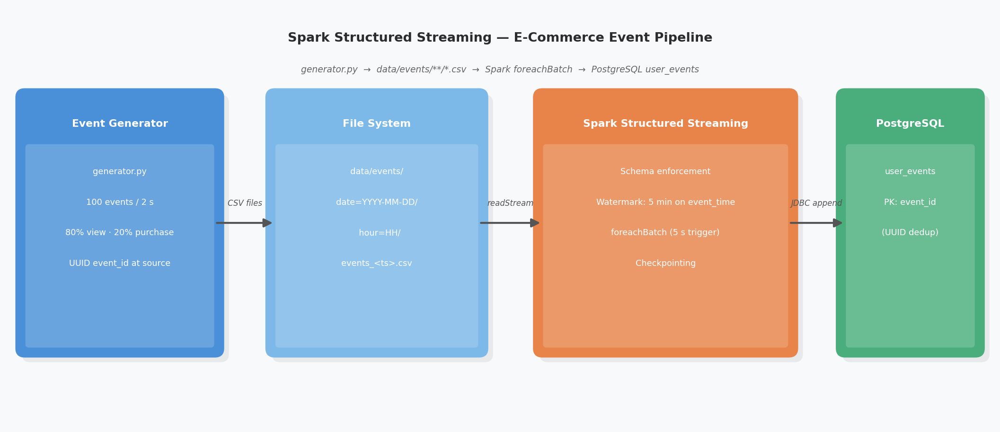

# Spark Structured Streaming E-Commerce Pipeline

## Overview

This project implements a fault-tolerant, real-time data pipeline for processing e-commerce user events using Apache Spark Structured Streaming with PostgreSQL as the serving layer. The system simulates continuous event generation, stream ingestion, transformation, and direct delivery to a relational database.

Key objectives:

- Demonstrate production-grade streaming patterns with Spark Structured Streaming
- Enforce data integrity through strict schema validation and primary key constraints
- Provide end-to-end observability and automatic fault recovery via checkpointing
- Support scalable micro-batch processing with configurable trigger intervals

---

## Architecture



```
┌──────────────────┐      ┌────────────────────┐      ┌─────────────────────┐
│  Event Generator │      │  data/events/       │      │  Spark Structured   │
│  (generator.py)  │─────▶│  date=.../hour=.../ │─────▶│  Streaming          │
│                  │      │  events_*.csv        │      │  (main app)         │
└──────────────────┘      └────────────────────┘      └──────────┬──────────┘
                                                                  │ JDBC append
                                                                  ▼
                                                       ┌─────────────────────┐
                                                       │  PostgreSQL          │
                                                       │  • user_events (PK)  │
                                                       └─────────────────────┘
```

### Data Flow

```
generator.py  →  data/events/**/*.csv  →  Spark foreachBatch  →  PostgreSQL user_events
```

---

## Components

### 1. Event Generator (`generator.py`)

- Produces synthetic e-commerce events at a rate of 100 events every 2 seconds
- Event distribution: 80% `view`, 20% `purchase`
- Each event carries a UUID `event_id` generated at source
- Output partitioned by date and hour: `data/events/date=YYYY-MM-DD/hour=HH/events_<ts>.csv`

### 2. Spark Structured Streaming (`spark_streaming_to_postgres.py`)

- **Source**: File-based stream reader monitoring `data/events/` (1 file per trigger)
- **Schema enforcement**: Strict `StructType` schema — malformed records are rejected at ingestion
- **Watermarking**: 5-minute tolerance on `event_time` to handle late-arriving data
- **Transformation**: Null `event_id` filter; `processing_time` column added per micro-batch
- **Sink**: `foreachBatch` with direct JDBC `append` to `public.user_events`
- **Trigger interval**: 5 seconds (`processingTime="5 seconds"`)
- **Fault tolerance**: Offset checkpointing at `checkpoints/events_pipeline/`

### 3. Database (`postgres_setup.sql`)

- Single table `user_events` with `event_id TEXT PRIMARY KEY`
- UUID primary key provides natural deduplication — duplicate events are rejected at the DB layer
- No staging table; batch landing and merge happen atomically via JDBC

---

## Features

| Feature                | Implementation                                                   |
| ---------------------- | ---------------------------------------------------------------- |
| **Idempotent writes**  | UUID `event_id` PRIMARY KEY rejects duplicate records            |
| **Schema enforcement** | Strict `StructType` at stream ingestion                          |
| **Fault tolerance**    | Spark offset checkpointing — no batch is skipped on restart      |
| **Late data handling** | 5-minute watermark on `event_time`                               |
| **Observability**      | Structured logging per batch with record count and duration      |
| **Scalability**        | File partitioning + configurable batch size and trigger interval |

---

## Prerequisites

- Python 3.9+
- Apache Spark 3.x with PySpark
- PostgreSQL 15+
- PostgreSQL JDBC driver (included: `postgresql-42.7.3.jar`)

```bash
pip install pyspark psycopg2-binary pandas
```

---

## Quick Start

### 1. Start PostgreSQL

```bash
docker run -d \
  --name ecommerce-postgres \
  -e POSTGRES_USER=stream_user \
  -e POSTGRES_PASSWORD=stream_pass \
  -e POSTGRES_DB=ecommerce_stream \
  -p 5432:5432 \
  postgres:15
```

### 2. Initialize the Database Schema

```bash
docker exec -i ecommerce-postgres psql -U stream_user -d ecommerce_stream < postgres_setup.sql
```

### 3. Start the Event Generator (Terminal 1)

```bash
python generator.py
```

### 4. Start the Streaming Pipeline (Terminal 2)

```bash
spark-submit \
  --jars postgresql-42.7.3.jar \
  spark_streaming_to_postgres.py
```

---

## Configuration

Connection parameters are defined in `spark_streaming_to_postgres.py`:

```python
JDBC_URL = "jdbc:postgresql://localhost:5432/ecommerce_stream"

JDBC_PROPERTIES = {
    "user": "stream_user",
    "password": "stream_pass",
    "driver": "org.postgresql.Driver"
}
```

Key tuning knobs:

| Parameter            | Location       | Default | Effect                         |
| -------------------- | -------------- | ------- | ------------------------------ |
| `BATCH_SIZE`         | `generator.py` | `100`   | Events per CSV file            |
| `SLEEP_INTERVAL`     | `generator.py` | `2s`    | File write cadence             |
| `maxFilesPerTrigger` | streaming app  | `1`     | Files consumed per micro-batch |
| `processingTime`     | streaming app  | `5s`    | Micro-batch trigger interval   |
| Watermark delay      | streaming app  | `5 min` | Late data tolerance            |

---

## Database Schema

### `user_events`

| Column            | Type            | Constraint      | Description                                       |
| ----------------- | --------------- | --------------- | ------------------------------------------------- |
| `event_id`        | `TEXT`          | **PRIMARY KEY** | UUID — unique event identifier, deduplication key |
| `event_time`      | `TIMESTAMP`     | NOT NULL        | When the event occurred (source time)             |
| `user_id`         | `VARCHAR(50)`   |                 | `user_N` (N = 1..1000)                            |
| `product_id`      | `VARCHAR(50)`   |                 | `product_N` (N = 1..500)                          |
| `event_type`      | `VARCHAR(20)`   |                 | `view` or `purchase`                              |
| `price`           | `NUMERIC(10,2)` |                 | Purchase amount; `0.00` for views                 |
| `ingestion_time`  | `TIMESTAMP`     |                 | Timestamp when the CSV file was written           |
| `processing_time` | `TIMESTAMP`     |                 | Timestamp when Spark processed the record         |

---

## Monitoring and Logs

| Log file                   | Content                                                  |
| -------------------------- | -------------------------------------------------------- |
| `logs/data_generator.log`  | File write events from generator                         |
| `logs/spark_streaming.log` | Per-batch SUCCESS/FAILURE with record count and duration |
| `logs/metrics.log`         | Pipeline metrics                                         |

Tail all logs in real time:

```bash
tail -f logs/*.log
```

Check stream progress and executor state via the **Spark UI** at [http://localhost:4040](http://localhost:4040).

---

## Validation Queries

```sql
-- Record count by event type
SELECT event_type, COUNT(*) AS total
FROM user_events
GROUP BY event_type;

-- Latest 10 processed events
SELECT event_id, event_time, event_type, processing_time
FROM user_events
ORDER BY processing_time DESC
LIMIT 10;

-- End-to-end latency (processing_time - event_time)
SELECT AVG(EXTRACT(EPOCH FROM (processing_time - event_time))) AS avg_latency_seconds
FROM user_events;
```

---

## Performance Characteristics

| Metric             | Value                                           |
| ------------------ | ----------------------------------------------- |
| Throughput         | ~3,000 events/min (100 events × 30 batches/min) |
| End-to-end latency | < 10 seconds (micro-batch)                      |
| Trigger interval   | 5 seconds                                       |
| File cadence       | 1 file / 2 seconds                              |

---

## Directory Structure

```
Spark_Structured_Streaming/
├── generator.py                    # Event producer — writes partitioned CSVs
├── spark_streaming_to_postgres.py  # Spark Structured Streaming pipeline
├── postgres_setup.sql              # Database schema (user_events only)
├── postgresql-42.7.3.jar           # PostgreSQL JDBC driver (required by spark-submit)
├── system_architecture.png         # Architecture diagram
├── data/events/                    # Input stream landing zone (auto-created)
│   └── date=YYYY-MM-DD/
│       └── hour=HH/
│           └── events_*.csv
├── checkpoints/events_pipeline/    # Spark offset checkpoints (fault recovery)
├── logs/                           # Observability
│   ├── data_generator.log
│   ├── spark_streaming.log
│   └── metrics.log
├── project_overview.md
├── user_guide.md
├── performance_metrics.md
├── test_cases.md
└── README.md
```

---

---

## License

Apache 2.0
